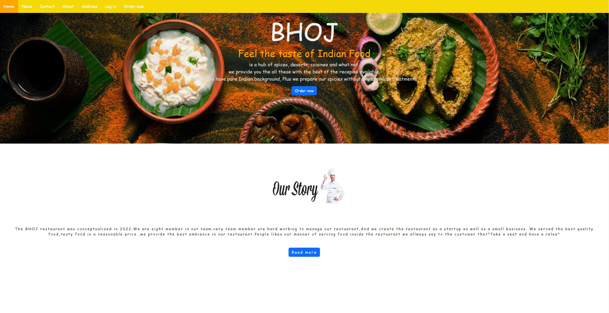

<h1 align="center"><a href="https://bhoj-restaurant.netlify.app/main.html" target="_blank">Bhoj Restaurant</a></h1>

  

<h2>About</h2>
"Bhoj Restaurant" is an exciting frontend project that aims to create a visually appealing and user-friendly website for a fictional restaurant called "Bhoj." The primary goal of this project is to showcase our proficiency in HTML and CSS to build an engaging and responsive website that highlights the restaurant's unique offerings and ambiance.

<h2>Ingredients</h2>

    
    
    
    <!--  -->

<h2>Project Documentation</h2>

    <a href="https://drive.google.com/file/d/1-Dr8gGYn51KuNSSpIdV1rxKEVzHKUeda/view?usp=sharing" target="_blank">👉 Concept Note</a> 
    <a href="https://docs.google.com/presentation/d/1KKEx_YTAE_rYkL1CHnxOuu-Fk10cx_OX/edit?usp=sharing&ouid=113059577862260438750&rtpof=true&sd=true" target="_blank">👉 Presentation PPT</a>

<h2>Team Members</h2>

Tanmoy Santra

Soumyajit Ghosh

Souvik Hazra

Apurba Maity

Subarna Mandal

Soumyajit Nath

Jit Ghosh

